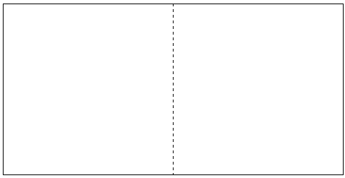
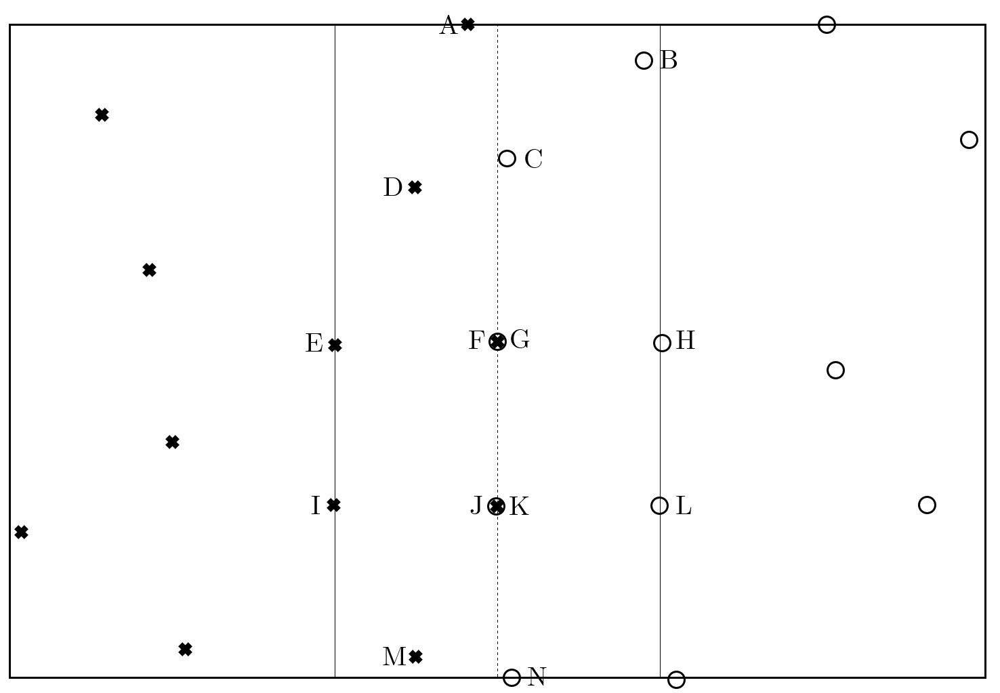
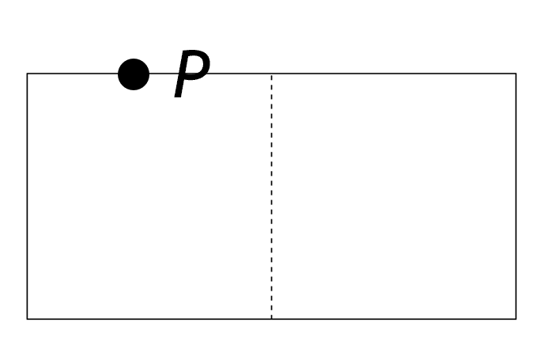

# 2D Closest Pair
_This activity was discontinued in Winter 25._

## 🎯 Learning Objectives
By the end of this activities, students should be able to:
1. Apply geometric reasoning to estimate minimal distances between 2D points.
2. Use the Pigeonhole Principle to derive bounds on spatial arrangements.
3. Explore optimizations related to divide-and-conquer in the context of the Closest Pair problem.

## 🧰 Materials / Props
- [Closest pair worksheet](./closest-pair-ws.pdf) (Make sure to print to scale)
- [Paper rulers](./ruler.pdf) (in inches) for measuring poiny distances.

⚠️ Accurate scaling is crucial for meaningful results — ensure that PDF scaling is set to 100% (no shrinking/stretching) when printing.

If you'd like to create your own version of the worksheet, you can use the raw images or diagrams here and insert them into a drawing tool or document editor that allows you to control dimensions precisely.
- [Challenge 1](./challenge1.png)
- [Challenge 2](./challenge2.jpg)

## 🕹️ Activity Walkthrough

**Time:** 15-20 minutes

**Setup:**
- Distribute printed worksheets and rulers to each group of 3-4 students.
- Group should complete two spatial challenges involving point placements and distance mesaurements.

### Challenge 1: Spacing Points
- Instructions on slide:
    <blockquote>
    <ul>
       <li> You are given a 2-inch by 1-inch rectangle below. 
       <li> The left half is for X points, and the right half is for O points. 
       <li> Plot as many Xs and Os as possible within their respective halves, ensuring that no two points of the same symbol are closer than 1 inch apart. 
       <li> Both symbols (X and O) may lie on the dotted median line, and different symbols do not have to be 1 inch apart.
    </ul>
        

            
        

    </blockquote>

### Challenge 2: Distance Checks
- Instructions on slide:
    <blockquote>
    <ul>
        <li> In the box of points below, a 2-inch by 4-inch strip is drawn in the middle. 
        <li> For each point in the strip, find all other points that are less than 1-inch away from it. 
        <li> Follow alphabetical order when checking distances and aim to use as few checks as possible. 
    </ul>
    

        
    

    </blockquote>

**💡Facilitating Tips:**
- Remind students to use rulers carefully and consistently.
- In discussions, guide them toward key divide-and-conquer ideas: limiting comparisons by partitioning the plane.
- Consider drawing parallels to the 1D closest pair problem or sorting-based approaches.

## 📘 Instructor's Solution

### Challenge 1: Spacing Points

We can fit at most four points in the left square (WLOG, the right square) without breaking the 1-inch distance rule. To prove this rigorously, we first make the following observation:

> If two points are in the same sub-square, then their distance must be less than 1 inch.

**Proof (by contradiction)**: Suppose we can fit five points without breaking the 1-inch distance rule. By Pigeonhole Principle, at least two points are in the same sub-square. By observation above they break the 1-inch distance rule, contradiction

### Challenge 2: Distance Checks

Brute force requires many comparisons, but geometric locality (e.g., strip narrowing) reduces unnecessary checks. For any point $P$, only check points within a 2-inch by 1-inch rectangle, where $P$ lies on the top (or bottom) edge of the strip.
    

        
    

- ** Key insight:** If there’s another point Q less than 1-inch away from P, then Q must be in this 2-inch by 1-inch rectangle. 
- From Challenge 1: Since the points are already ordered by their y-coordinates, this means at most we only need to check the next 7 points in the list
- This significantly reduces the number of comparisons needed in the ClosestPair algorithm.

## 📝 Eric's Notes

- This activity was discontinued because:
    - The props were annoying to print, scale, and distribute correctly.
    - It felt underwhelming — students often finished quickly without gaining much insight.
    - It ended up being more of a worksheet-style lecture review than a dynamic or engaging activity.
    - Overall, it didn’t add much value beyond what could be was covered in lecture.
- For future staff: Consider swapping this activity with [the Skyline Problem](https://www.geeksforgeeks.org/the-skyline-problem-using-divide-and-conquer-algorithm/) to avoid overlapping too much with the lecture’s closest-pair divide-and-conquer content, and to create more room for conceptual exploration.
