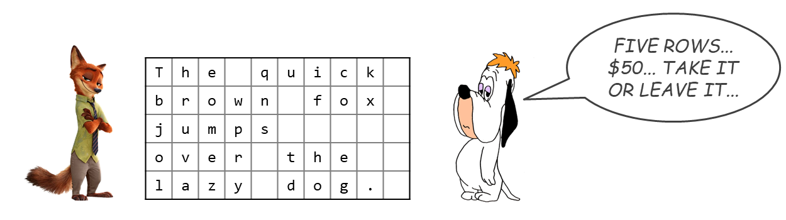

# Copying Conundrum
_This activity was converted into a "think-pair-share" mini activity in Winter 25._

## 🎯 Learning Objectives
By the end of this activities, students should be able to:
1. Apply a greedy strategy to solve optimization problems.
2. Reason about the structure of greedy algorithms and the conditions under which they are optimal.
3. Understand the exchange argument as a justification for greedy optimality (via class discussion)

## 🧰 Materials / Props
- [Copying conumdrum worksheet](./copying-ws.pdf) (Fall 24 version), or simply a 5 by 10 grid on a piece of paper. 

## 🕹️ Activity Walkthrough

**Time**: 8-10 minutes

**Setup**:
- Present the problem using the story: 
  > Nick is trying to design an advertisement, but Droopy is charging him for every row of text he uses! Each row can fit 10 characters, including letters, spaces, and punctuation. Nick needs to place the text in order, without splitting any words across rows. His goal is to use the fewest number of rows possible to keep the costs low and avoid paying too much to Droopy.
- Show Nick's attempt (5 rows), which students will later try to beat (or match).
  

      
  

- Instructions to students:
  1. **Think** (1 minute): Individually come up with a new layout that uses no more rows than Nick.
  2. **Pair** (1-2 minutes): Discuss your strategy with a neighbor and see if your layouts agree.
  3. **Share** (2–3 minutes): Raise hands to share strategies. Ask students to:
      - Describe their greedy approach.
      - Compare where their solution first differs from Nick’s.
      - Reflect on whether multiple optimal layouts exist and why.

**💡Facilitating Tips**:
- For pairs who finish early, prompt them to come up with alternate arrangements that still use the same number of rows.
- During discussion, guide students to notice that optimal solutions may differ in where words appear (e.g., “lazy” on line 4 vs. 5), but the total number of rows remains the same.
- Introduce the exchange argument as a formal justification for the greedy approach: if two optimal solutions differ, the first point of difference can be "exchanged" without increasing cost, preserving optimality.
- Emphasize the two key components in an exchange argument proof: validity and optimality. 
- A few students may say, "Isn’t this obvious?" when writing parts of the proof. Remind them: even if it feels obvious, it still needs to be stated explicitly for a complete and rigorous argument.

## 📘 Instructor's Solution
- See detailed solution and discussion [here](./copying-conundrum-slides.pdf).

## 📝 Eric's Notes

- Converted into think-pair-share because it was short and natural for partner discussion.
- The exchange argument was not formally part of the student activity but covered during whole-class debrief.
- Some notations on the slides, like $r_\text{diff}$ and $o_\text{diff}$, may be confusing—make sure to clarify that these refer to the indices of the differing word in the student solution vs. Nick’s.
- Greedy exchangea argument is one of the topics where students struggle with. Make sure to:
  - Emphasize what exactly is being exchanged and why it preserves feasibility and cost.
  - Encourage students to state every step clearly, even if it feels obvious.
  - Walk through one complete example on the board, pointing out how the swap does not worsen the solution and can be repeated until the greedy solution is reached.
