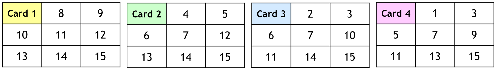
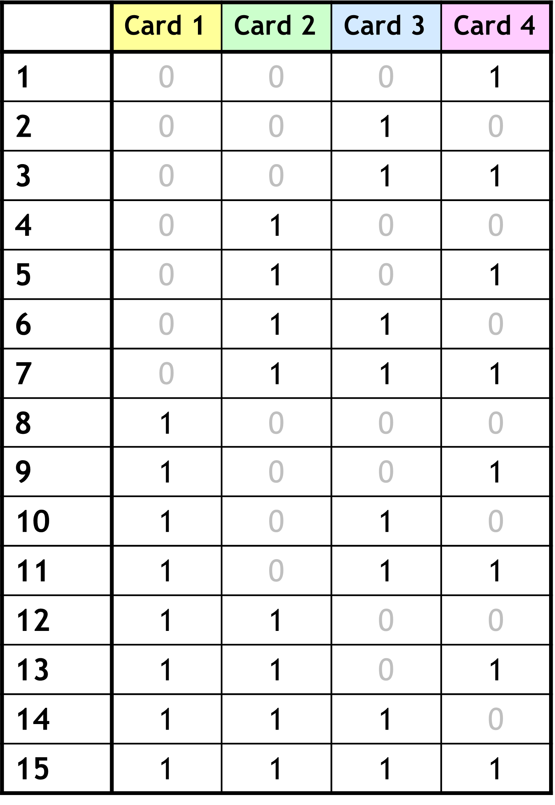

# Magic Number Cards


## 🎯 Learning Objectives
By the end of this activities, students should be able to:
1. Gain intuition for how to find an exact solution using only yes/no questions.

## 🧰 Materials / Props
- Magic cards:
  <p align="center">
      
  </p>
## 🕹️ Activity Walkthrough

**Time**: 5 minutes

**Setup**:
1. Pair up students
2. One student picks a secret number from 1–15. The other asks, "Is your number on this card?" for each of the four cards, then tries to guess the number.

**💡Facilitating Tips**:
- Walk around and listen to student explanations—ask things like "What does Card 3 tell you?"
- If students finish early, challenge them to do it with numbers up to 31 (using 5 cards).

## 📘 Instructor's Solution
Each card tells one bit of the secret number. For example, if the secret number is 10, it should appear on cards 1 and 3. refer to the "lookup table"
  <p align="center">
      
  </p>
Formally, let $s \in \{1, \ldots, k\} be a "secret integer" that nobody knows. Define

$$

    \text{SECRET} = \{A: \text{$A$ is an array that contains $s$} \}

$$

Let $D$ be an oracle for $\text{SECRET}$, we can find the secret integer by querying the oracle:

```
function FindSecret(k): // k is the upper bound for s
    Create cards 1, 2, ..., ⌈log₂k⌉
    Query D with each card as array
    Deduce s by assembling each bit of it
```

Main takeaway: We can find an exact solution (the secret number) using only yes/no questions

## 📝 Eric's Notes
- First starter in Winter 25. The simplicity of the trick really captured students' attention and served as a fun, low-stakes way to reintroduce binary representation and information theory.

