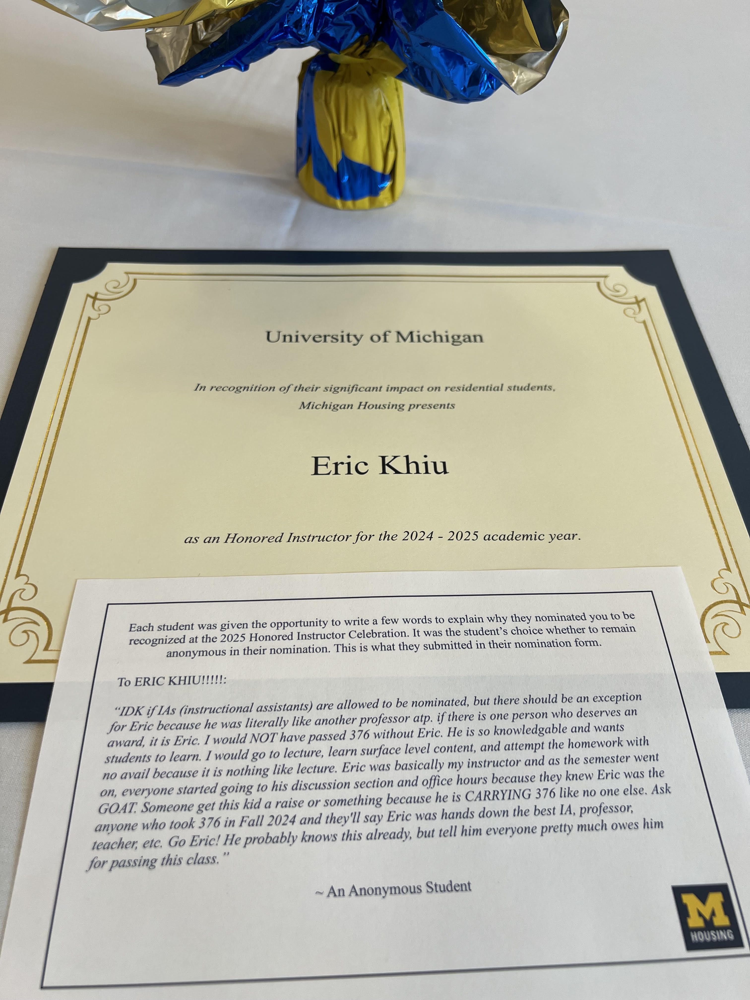

(intro)=
# EECS 376 Discussions

## About This Site

Welcome! This site is a curated collection of the interactive discussion activities I've helped design and run for [EECS 376: Foundations of Computer Science](https://eecs376.org/) at the University of Michigan. Starting in Fall 2024, we introduced a new attendance incentive policy — attending a minimum number of discussion sections can earn you bonus points on your final grade, replacing a small portion of your exam score.

To make that policy meaningful, we reimagined discussion sections to be more interactive, collaborative, and engaging. Rather than mere PowerPoint presentations, we've adopted inquiry-based learning (IBL): students work in small groups through guided worksheets and activities that encourage exploration, discussion, and peer reasoning. Many of these activities are showcased here.

This shift reflects my own passion for teaching and learning — and my background in math education research, which focused on how to make abstract content engaging and inclusive in undergraduate settings.

## About Me

I'm Eric Khiu, a soon-alum of the University of Michigan Class of 2025, majoring in Computer Science, Data Science, and Mathematics.

<em>[Placeholder for graduation picture, coming soon!]</em>

I've served as an Instructional Aide (IA) for EECS 376 across four terms: Winter 2024, Spring 2024, Fall 2024, and Winter 2025. Throughout these semesters, I've designed and refined a variety of discussion-based activities — many of which are featured on this site.

During my undergraduate, I spent two years conducting research in undergraduate mathematics education, with a focus on:
- Interactive learning materials (e.g., interative textbooks) and how students use them.
- Classroom inclusivity, particularly for students from diverse academic and socioeconomic backgrounds.

My teaching experience extends beyond EECS as well. I worked as a tutor in the Math Lab (Math Learning Center) in 2023 and taught Math 310: Chances and Choice in Winter 2025. I was honored to received the Honored Instructor award for the 2024–2025 academic year from Michigan Housing.

    

Some other comments I received from my recent teaching evaluations:
- "Eric is an amazing instructor who makes every discussion engaging, interesting, and easy to follow. His in class activities/games and comprehensive slides make the content very digestible." (W25)
- "Eric does an amazing job at fostering group problem solving and practicing the concepts we learned during lecture. I particularly like the way he explains how to solve each type of problem (e.g. the recipes)." (W25)
- "Eric is actually the best EECS IA I have ever had. Not only does he know the course material front and back, but I can tell he genuinely wants students to succeed. He does so much for this class, and I hope he knows how much everyone appreciates him! I read a Piazza post earlier this semester (written by Eric lol) that discussion is supposed to help bridge the gap between lecture and homework/exams. I say with full confidence that his discussion does fully that and makes me feel more confident in the material. I don’t think I have ever felt this comfortable in an EECS core class, and I truly owe it to Eric’s discussion and office hours." (W25)
- "Eric is probably the best EECS TA I have had for any class. He explains things so well and is clearly very knowledgeable about this topic. He understands where students may have trouble." (F24)
- "Eric was always great whether it was in discussion section or in his office hours. He always led us to the answers but didn't just give them to us. He's also very thorough when explaining things which is helpful for understanding it." (F24)
- "Eric is doing a great job. Eric is probably the best EECS TA I have had for any class. He explains things so well and is clearly very knowledgeable about this topic. He understands where students may have trouble. Eric deserves a raise!" (F24)
