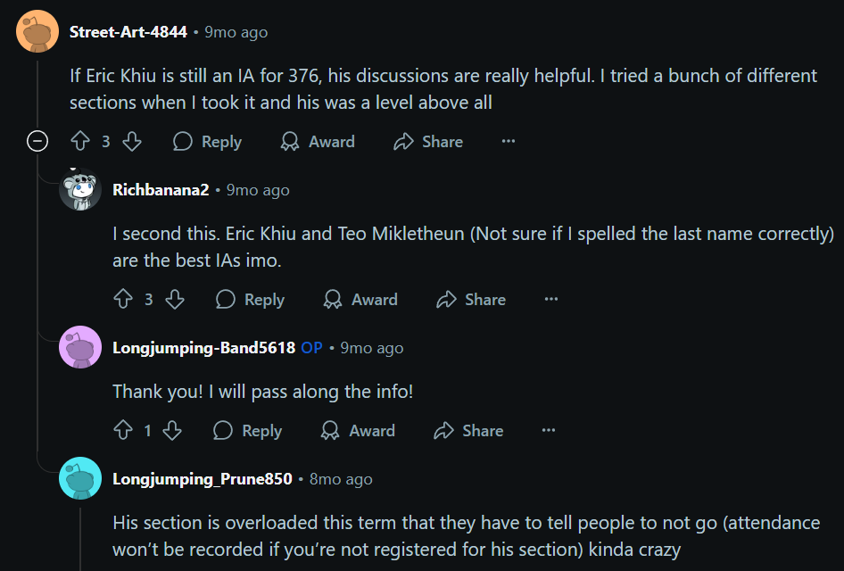

(intro)=
# EECS 376 Tutoring with Eric

## About This Site

Welcome! This site is the landing page for my **private tutoring services** in EECS 376: *Foundations of Computer Science*.  

My goal is to provide **clear, engaging, and personalized guidance** — helping you strengthen your understanding of algorithms, complexity, and proof techniques while building confidence in problem solving.

Interested? Schedule your session [here](https://erickhiu.github.io/eecs376-tutoring/main/scheduling.html).

## About Me

I'm Eric Khiu, an alumnus of the University of Michigan Class of 2025, majoring in Computer Science, Data Science, and Mathematics.

    

I've served as an Instructional Aide (IA) for EECS 376 across four terms: Winter 2024, Spring 2024, Fall 2024, and Winter 2025. Throughout these semesters, I've designed and refined a variety of discussion-based activities — many of which are featured on [this site](https://erickhiu.github.io/eecs376-disc/main/intro.html).

My teaching experience extends beyond EECS as well. I worked as a tutor in the Math Lab (Math Learning Center) in 2023 and taught Math 310: Chances and Choice in Winter 2025. 

During my undergraduate, I spent two years in Research in Teaching Mathematics in Undergraduate Settings (RTMUS) Lab under supervision of Prof. Vilma Mesa, with a research focus on:
- The design and use of interactive learning materials, such as digital textbooks, and how students engage with them to build conceptual understanding.
- Learning theories and pedagogical strategies that support the development of mathematical mastery.
- Classroom inclusivity, with particular attention to supporting students from diverse academic and socioeconomic backgrounds.

I was also honored to received the Honored Instructor award for the 2024–2025 academic year from Michigan Housing.

    

Some other comments I received from my recent teaching evaluations:
- "Eric is an amazing instructor who makes every discussion engaging, interesting, and easy to follow. His in class activities/games and comprehensive slides make the content very digestible." (W25)
- "Eric does an amazing job at fostering group problem solving and practicing the concepts we learned during lecture. I particularly like the way he explains how to solve each type of problem (e.g. the recipes)." (W25)
- "Eric is actually the best EECS IA I have ever had. Not only does he know the course material front and back, but I can tell he genuinely wants students to succeed. He does so much for this class, and I hope he knows how much everyone appreciates him! I read a Piazza post earlier this semester (written by Eric lol) that discussion is supposed to help bridge the gap between lecture and homework/exams. I say with full confidence that his discussion does fully that and makes me feel more confident in the material. I don’t think I have ever felt this comfortable in an EECS core class, and I truly owe it to Eric’s discussion and office hours." (W25)
- "Eric is probably the best EECS TA I have had for any class. He explains things so well and is clearly very knowledgeable about this topic. He understands where students may have trouble." (F24)
- "Eric was always great whether it was in discussion section or in his office hours. He always led us to the answers but didn't just give them to us. He's also very thorough when explaining things which is helpful for understanding it." (F24)
- "Eric is doing a great job. Eric is probably the best EECS TA I have had for any class. He explains things so well and is clearly very knowledgeable about this topic. He understands where students may have trouble. Eric deserves a raise!" (F24)

... and here is what people said about me on Reddit:

    

